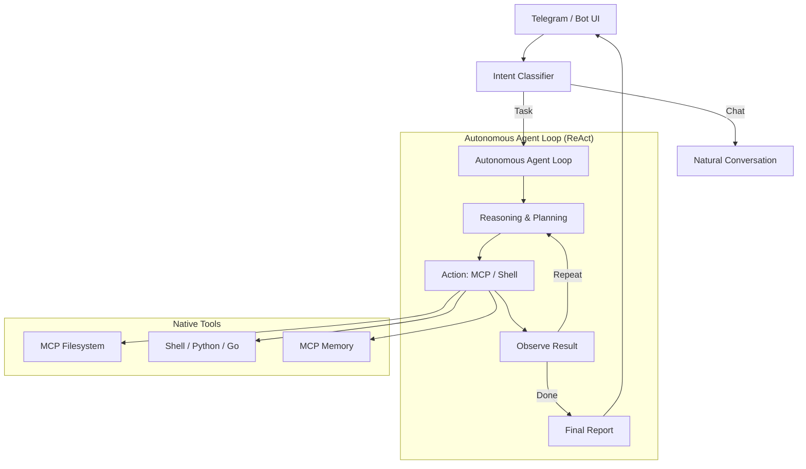

# CoderX 🤖

> Autonomous AI Developer Bot — Nhận lệnh từ Telegram, tự lập kế hoạch bằng ChatGPT và trực tiếp thực thi bằng Native Tools (MCP/Shell).

## Kiến trúc



## Setup

### 1. Cài dependencies
```bash
cd CoderX
python3 -m venv venv
source venv/bin/activate
pip install -r requirements.txt
```

### 2. Tạo .env
```bash
cp .env.example .env
# Điền các API keys vào .env
```

### 3. Lấy Telegram User ID
Gửi tin nhắn cho [@userinfobot](https://t.me/userinfobot) trên Telegram để lấy User ID của bạn.

### 4. Chạy bot
```bash
python main.py
```

## Commands Telegram

| Command | Mô tả |
|---------|--------|
| `/task <nhiệm vụ>` | 🚀 Giao nhiệm vụ coding/technical cho Agent |
| `/status` | 📊 Xem tiến độ và hành động hiện tại |
| `/workspace <path>` | 📁 Xem hoặc đổi thư mục làm việc |
| `/stop` | 🛑 Dừng Agent và xóa hàng đợi |
| `/queue` | 📋 Xem danh sách các task đang chờ |

## Cách hoạt động

Khi bạn gửi yêu cầu "Tạo REST API users với Flask":

1. **Intent Classifier**: Nhận diện đây là một `task` và gửi vào `TaskQueue`.
2. **Autonomous Agent**:
   - **REASON**: Phân tích workspace hiện tại, tech stack và yêu cầu.
   - **PLAN**: Quyết định hành động tiếp theo (ví dụ: đọc `requirements.txt`).
   - **ACT**: Thực thi công cụ (ví dụ: `mcp` -> `filesystem/list_dir`).
   - **OBSERVE**: Ghi nhận kết quả và lặp lại vòng lặp cho đến khi hoàn thành.
3. **Native Execution**: Agent trực tiếp ghi file, cài đặt thư viện và chạy test trên máy local của bạn.
4. **Final Report**: Sau khi hoàn thành hoặc thất bại, Agent gửi báo cáo tổng kết chi tiết về Telegram.

## Yêu cầu Hệ thống
- **OpenAI API Key**: Cần model hỗ trợ Tool Calling (gpt-4o / gpt-4-turbo).
- **MCP Servers**: CoderX sử dụng [Model Context Protocol](https://modelcontextprotocol.io) để tương tác với hệ thống. Mặc định cần `server-filesystem`.
